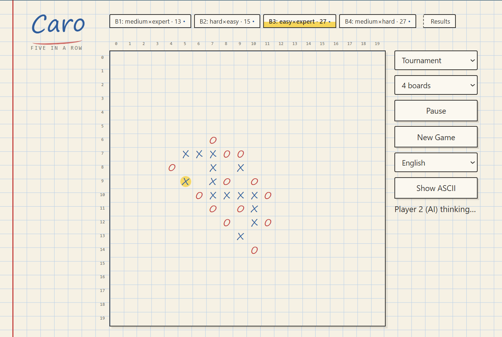

# Caro

Caro (Gomoku / five-in-a-row) on a 20×20 board, with a local engine you can play against or pit against itself.

Play against the computer, let the computer play first, or run a multi-board **Tournament** where every difficulty pairing races in parallel.



## Tournament

Tournament mode matches the four difficulty levels against each other: **easy**, **medium**, **hard**, and **expert**.

- Seat order matters. Hard going first against medium is a different match from medium going first against hard, because the opening move is an advantage.
- You can run several boards at once so pairings play in parallel. The page stays responsive while games run.
- When games finish, results are saved. Open **Results** to see wins, draws, and average move counts for each pairing and overall.

## The engine

The engine is the computer opponent behind every computer-controlled seat. Strength is controlled by difficulty:

- **Easy**: Shallow look-ahead, quick replies, more variety in play
- **Medium**: Deeper search and recognition of common traps
- **Hard**: Longer thinking time and full awareness of fork patterns
- **Expert**: The strongest profile, with extra time and forced-line hunting

Higher levels think longer and see more of the board. Lower levels move faster and play with more unpredictability.

## Walkthrough

### Requirements

- [Node.js](https://nodejs.org/) 18+ (developed on Node 24)
- npm (comes with Node)

### Install

```bash
npm install
```

### Build & start

```bash
npm start
```

This builds the app and starts a local server at [http://localhost:3000](http://localhost:3000).

Useful scripts:

| Command | What it does |
| --- | --- |
| `npm start` | Build and serve on port 3000 |
| `npm run build` | Build only |
| `npm test` | Run tests |
| `npm run typecheck` | TypeScript check |
| `npm run lint` | Lint |

Open the page, pick a mode (you first, computer first, or Tournament), choose difficulty or board count, and play — or watch the computers compete.
