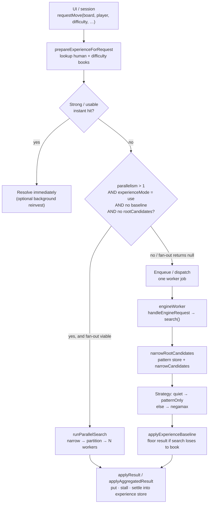
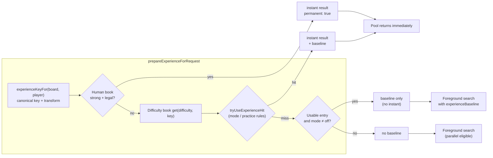
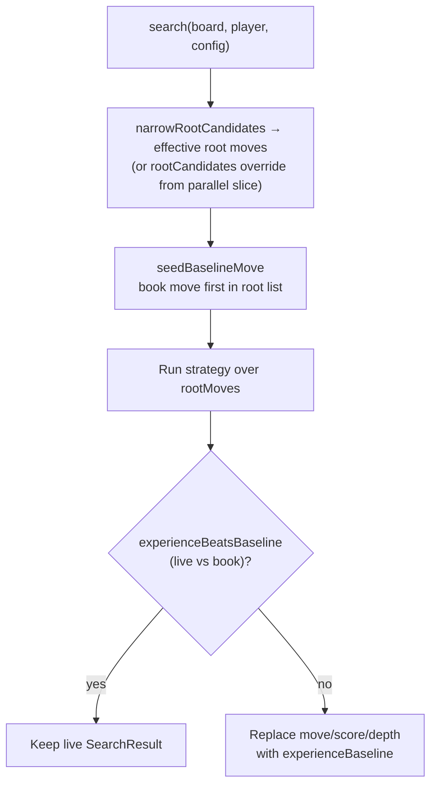
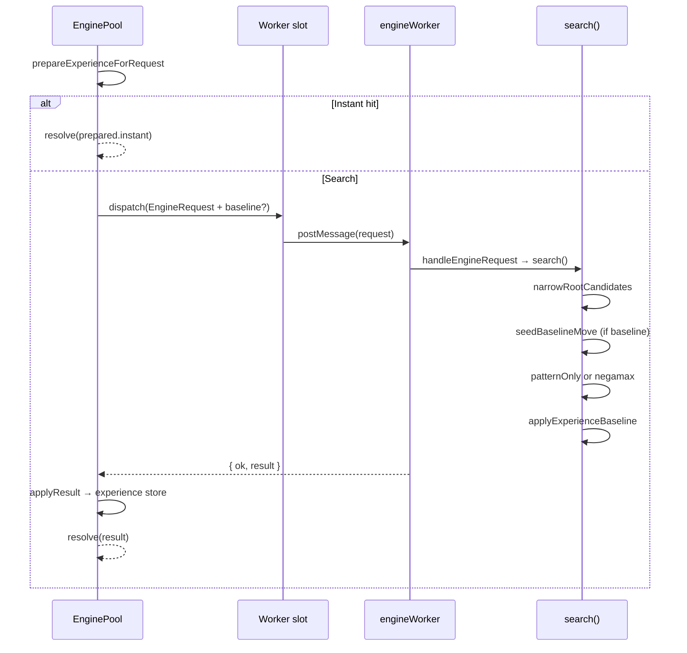
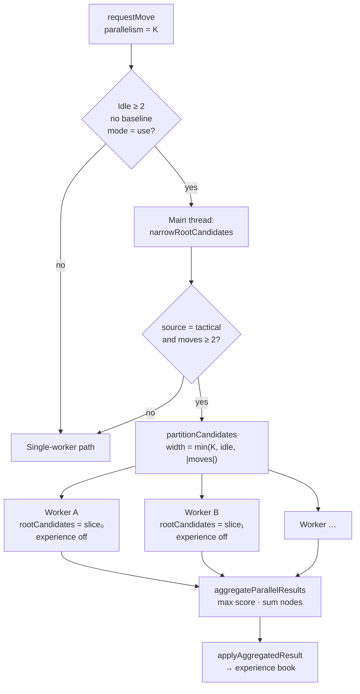
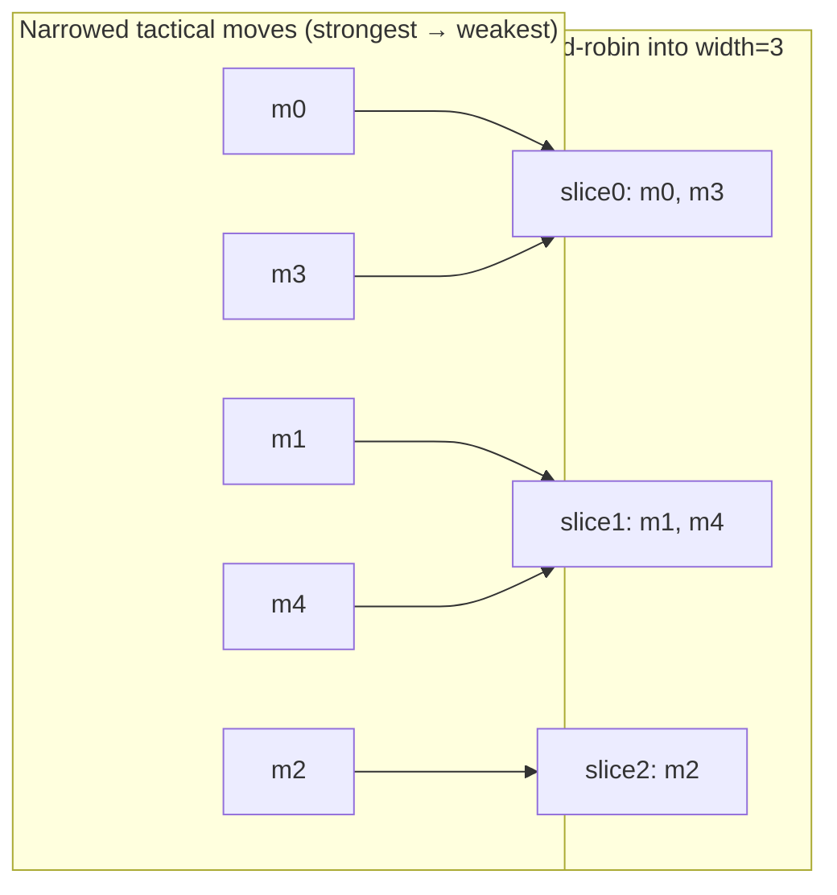
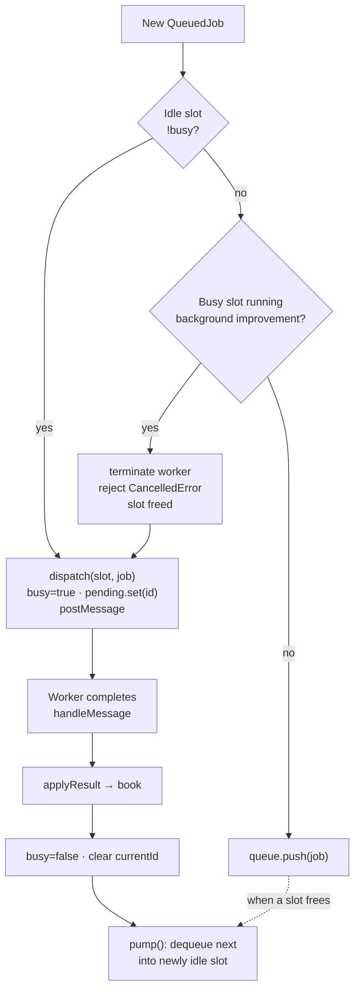
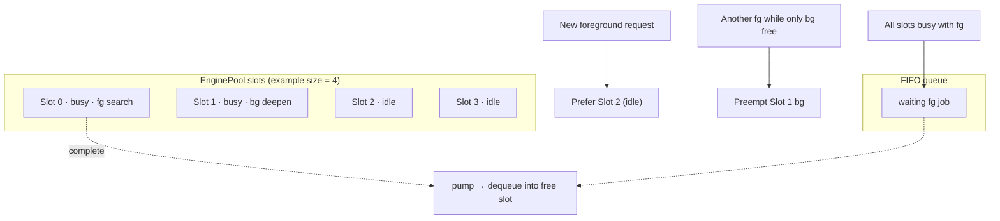

# Move Request Processing

How `EnginePool.requestMove` turns a board position into a `SearchResult`: experience cache, root narrowing, optional parallel fan-out, and worker-slot allocation.

Primary code: `src/ui/enginePool.ts`, `src/ui/engineProtocol.ts`, `src/ui/parallelSearch.ts`, `src/engine/search/search.ts`.

---

## 1. End-to-end overview



---

## 2. Experience cache: instant replay vs search baseline

The pool consults the experience store **before** any worker search. Two outcomes matter for later search quality:

| Outcome | When | Effect on search |
| --- | --- | --- |
| **Instant hit** | Strong usable entry (human book always; difficulty book via `tryUseExperienceHit`) | Return cached move; no foreground search. Non-permanent hits may enqueue a background deepen. |
| **Baseline only** | Usable entry that is not instant-replayed | Pass `experienceBaseline` into the worker. Search seeds that move at the root and **floors** the final result if the live search does not beat the book. |
| **Miss** | No usable entry / mode `off` | Full search with no floor. Parallel fan-out is only considered on this path (and only when `experienceMode === "use"`). |



### How the baseline shapes `search()`



So the cache does not only short-circuit work: when a usable entry exists but is not strong enough for instant replay, it **anchors** root ordering and **guarantees** the returned move is at least as good as the book (by score/depth rules in `experienceBeatsBaseline`).

---

## 3. Narrowing → search (single worker)

Every non-instant path that reaches a worker ends in `search()`:

1. **Narrow** — `narrowRootCandidates` builds/uses a `PatternStore`, counts stones, and runs `narrowCandidates` (forced / tactical / quiet sources).
2. **Override** — if `config.rootCandidates` is set (parallel slice), those moves replace the narrowed set (empty cells only).
3. **Budget** — optional `timeBudgetMs` stepped by own-stone count.
4. **Quiet shortcut** — single candidate or `source === "quiet"` → `patternOnlyStrategy` (no negamax).
5. **Otherwise** — `negamaxStrategy` over the seeded root list.
6. **Floor** — `applyExperienceBaseline` as above.



---

## 4. Parallelism > 1: distribute candidates across workers

Fan-out is coordinated on the **main thread** inside `runParallelSearch`. It runs only when all of these hold:

- Caller did not already pass `rootCandidates` (slice jobs never re-fan-out).
- `parallelism > 1`.
- `experienceMode === "use"`.
- **No** experience baseline (a book floor means single-worker search).
- At least **2 idle** slots after `min(parallelism, idle)`.
- Narrowing source is **`tactical`** and there are **≥ 2** candidates.

Then:

```text
width = min(parallelism, idleSlots, candidateCount)
slices = partitionCandidates(moves, width)   // round-robin, strongest-first order preserved across slices
```

Each slice is a `searchSlice` → `requestMove(..., { experienceMode: "off", persistExperience: false, rootCandidates: slice })`. Workers search their slice only; the coordinator picks the best true score (`aggregateParallelResults`) and writes the aggregate into the book once.





**Implication:** Parallel search explores disjoint root subsets with experience disabled per slice; quality of the *returned* move comes from aggregation. Experience still benefits future turns via the post-aggregate book write — but a **current** baseline forces the single-worker path so flooring stays coherent.

---

## 5. Worker allocation inside the pool

`EnginePool` owns a fixed array of **slots** (`size` set at construction). Each slot is `{ worker, busy, currentId }`. Workers are created lazily (`ensureWorker`) on first dispatch to that slot.



### Job classes and priority

| Kind | How it gets a slot | Queued? | Preemptible? |
| --- | --- | --- | --- |
| **Foreground move** | Idle slot, else preempt background, else queue | Yes | No (only cancelled via `cancelAll`) |
| **Parallel slice** | Same as foreground; N slices need N idle slots up front for fan-out | Via `requestMove` | Same as foreground |
| **Background reinvest** | Only if a slot is already idle; never queued | No | Yes — terminated when a foreground job needs a slot |



### Lifecycle helpers

- **`cancelAll`** — reject queue + terminate busy workers; idle workers kept; slots marked free; workers respawn lazily.
- **`terminate`** — `cancelAll` + kill idle workers + flush experience store (pool retirement / resize).

---

## 6. Compact “one move” mental model

```text
requestMove
  │
  ├─ prepareExperienceForRequest
  │     ├─ instant hit ──────────────────────────► return (+ maybe bg deepen)
  │     └─ else baseline? ──┐
  │                         │
  ├─ parallelism > 1, use, no baseline, ≥2 idle, tactical ≥2 moves?
  │     yes → narrow (main) → partition → N× searchSlice (exp off)
  │           → aggregate → write book → return
  │     no  → single job on a slot
  │              worker: search(narrow → seed baseline → strategy → floor)
  │              pool: applyResult → book → return
  │
  └─ slot policy: idle → dispatch; else preempt bg; else queue; pump on free
```

This is the path from a move request through narrowing, search, optional root-partition parallelism, experience flooring/caching, and fixed-size worker-pool allocation.
